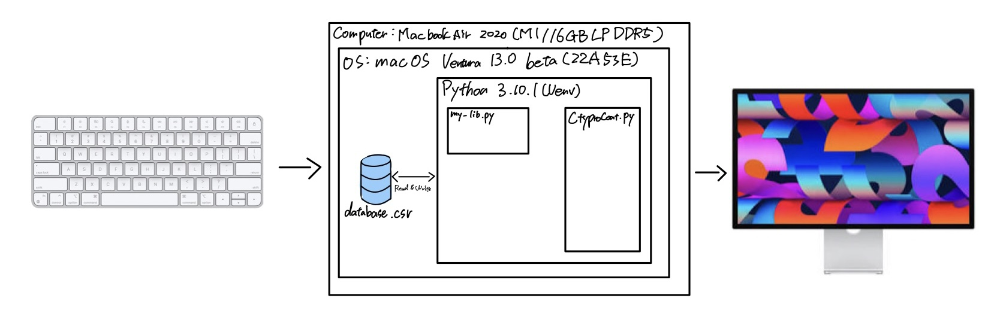

# Criteria A:Planning 

##problem definition

Ms. Sato is a local trader who is interested in the emerging market of cryptocurrencies. She has started to buy and sell electronic currencies, however at the moment she is tracking all her transaction using a ledger in a spreadsheet which is starting to become burdensome and too disorganized. It is also difficult for Ms Sato to find past transactions or important statistics about the currency. Ms Sato is in need of a digital ledger that helps her track the amount of the cryptocurrency, the transactions, along with useful statistics.

A part from these requirements, Ms Sato is open to explore a cryptocurrency selected by the developer.

An example of the data stored is
| Date | Description | Category | Amount  |
|------|-------------|----------|---------|
| Sep 23 2022 | bought a house | Expenses | 10 BTC |
| Sep 24 2022 | food for house celebration | Food | 0.000001 BTC |

## Proposed Solution

Design statement:
 I will design and make a digital ledger for a client who is Ms. Sato. Ms.Sato trades in cryptocurrency especially with MANA which is a digital coin in NFT games. The proposed digital ledger will store transactions regarding cryptocurrency and will be constructed using the language program called Python. It will take until Project Week to make and will be evaluated according to the criteria below.

** add a description of your coin and citation **
| Group 1   |              |   | Group  2  |           |
|-----------|--------------|---|-----------|-----------|
| Developer | Digital Coin |   | Developer | Coin      |
| Alex      | Bitcoin      |   | Alek      | Solana    |
| Bernard   | Ethereum     |   | Mai       | Dogecoin  |
| Yutaro    | Dogecoin     |   | Daniela   | BInance   |
| Verlon    | Apecoin      |   | Kris      | Bitcoin   |
| Oswell    | Tether       |   | Paula     | Lumens    |
| Thumula   | Tron         |   | ZAven     | Ethereum  |
| Ainee     | Mana         |   | Jonathan  | Maker     |
| Lison     | Solana       |   | Kai       | Avalanche |
| Sabu      | Binance      |   | Daiichiro | Flow      |
| Emmy      | Polkadot     |   | Masamu    | Cardano   |
| Maria     | Cardano      |   | Yasmina   | Zcash     |
| Zelan     | Cosmos       |   | Jana      | LiteCoin  |
| Manahil   | BinanceUSD   |   | Lyn       | Iota      |
| Krish     | UsdCoin      |   | Meisa     | Polkadot  |
|           |              |   | Mayte     | Cosmos    |
|           |              |   | Pop       | Ripple    |
|           |              |   | Gen       | MANA     |

Justify the tools/structure of my solution

Python has the advantage of having offside rules applied. So I will use Python for my solution because it offers a variety of libraries that can help provide Ms.Sato with useful statistical management. Also, Python can perform tasks with fewer lines of code than other older languages, providing simplicity, readability, and ease of understanding for both the programmer and the person reading the program.

Here is the structure of my solution.

The main Python file can use the various functions written in the library Python file to read, append, and write database files. Writing these different functions separately makes it easier to modify specific files and makes the program more manageable. Also, the main Python file is not as large, and the structure is clearer and easier to read.

I would choose MANA as the cryptocurrency of choice for this solution.

MANA is a virtual currency used within internet but also as an NFT token on Ethereum (virtual game).
In 2021, the currency's price soared 60 times for a period of time, attracting the attention of many investors. 
So what are the benefits to investing in this cryptocurrency?
MANA has the following four characteristics such as being used as a place for economic activities, as well as games such as 
VR space, utilizing blockchain technology　NFTs and can be earned and used in other NFT games despite different ownership of games.
Based on the above, we recommend MANA now that the growth potential of NFT is being attempted to sell.

## Success Criteria

1.The digital ledger is text-based software (run in Pycharm's Terminal).

2.The digital ledger displays a basic description of the selected cryptocurrency.

3.The electronic ledger allows users to enter, withdraw, and record transactions.

4.The electronic ledger can be accessed using a login password and uesrname providing privacy for the client.

5.The electronic ledger is able to show one diagram about economic activity of the client.

6.The electronic ledger can display the last 10 transactions of the client trading activity.

# Criteria B: Design

## System Diagram

*Fig.1* **System diagram of this program**

## Flow Diagrams

## Record of Tasks
| Task No | Planned Action             | Planned Outcome                                                                          | Time estimate | Target completion date | Criterion |
|---------|----------------------------|------------------------------------------------------------------------------------------|---------------|------------------------|-----------|
| 1       | Create system diagram      | To have a clear idea of the hardware and software requirements for the proposed solution | 10min         | Sep 22                 | B         |
| 2       | Interview with the Client  | To discuss client's needs and define success criteria                                    | 5min          | Sep 23                 | A         |
| 3       | Code the Menu              | To have menu items and title written on the screen                                       | 20min         | Sep 23 
