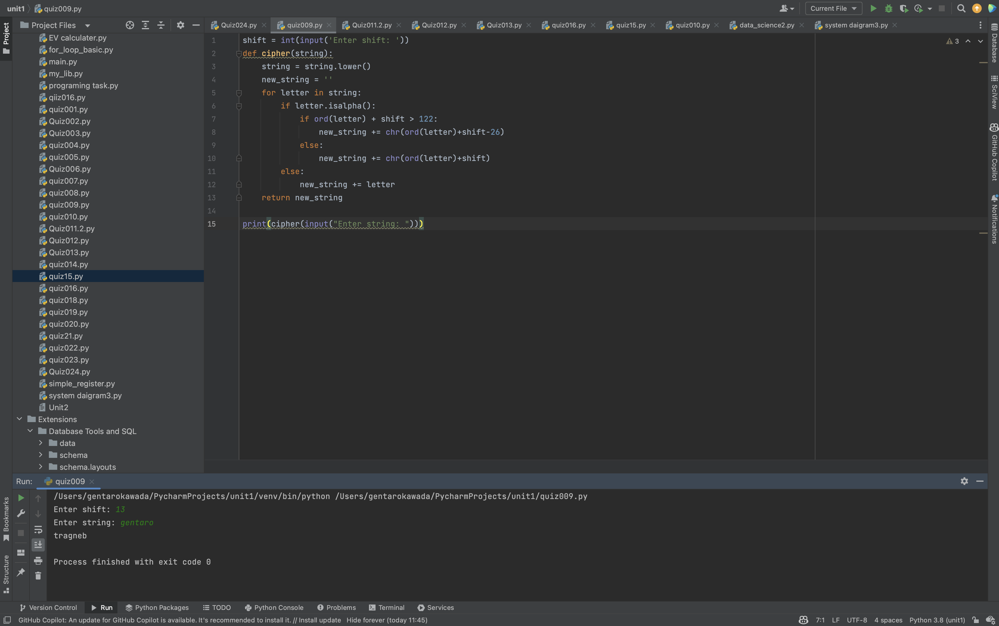

# Quiz009

## Create a function that receives as input a stering and reaturns the string ciphered with shift 13.

```.py
shift = int(input('Enter shift: '))
def cipher(string):
    string = string.lower()
    new_string = ''
    for letter in string:
        if letter.isalpha():
            if ord(letter) + shift > 122:
                new_string += chr(ord(letter)+shift-26)
            else:
                new_string += chr(ord(letter)+shift)
        else:
            new_string += letter
    return new_string

print(cipher(input("Enter string: ")))
```
## Fig.1


## Flowchart:

