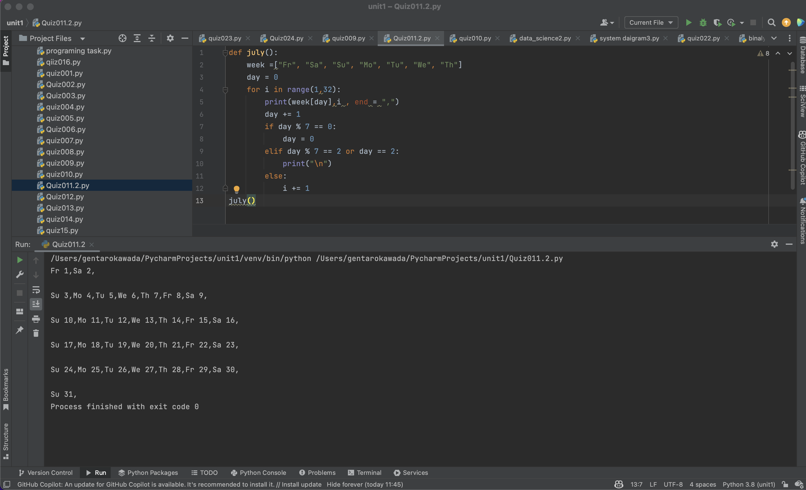
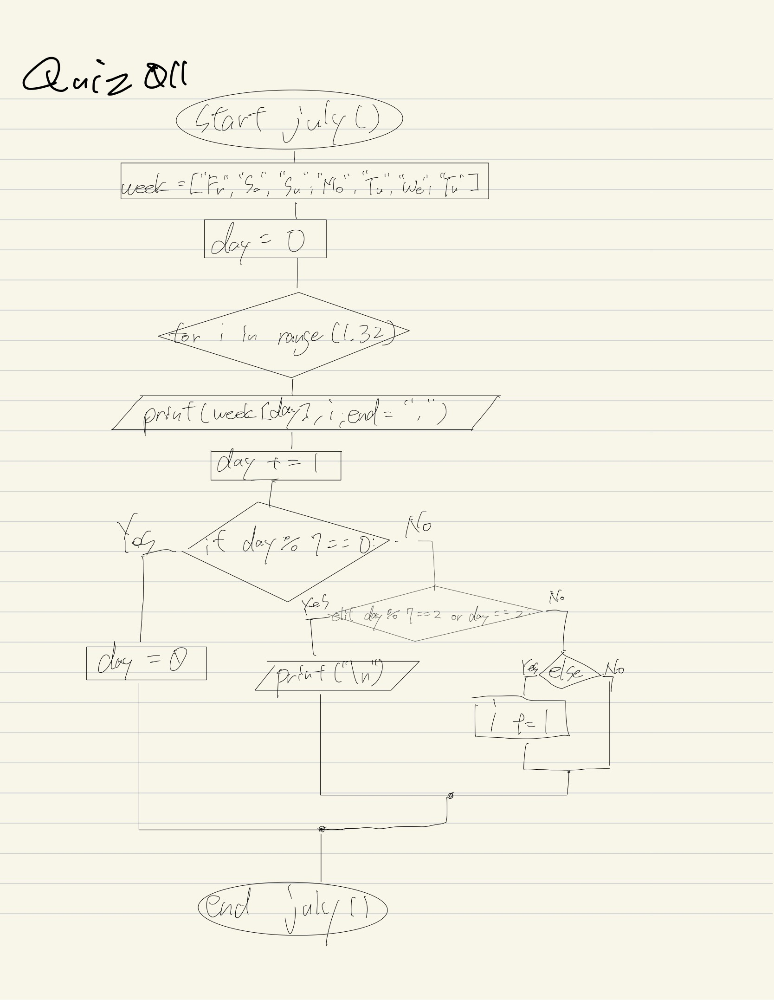

# Quiz011

## Create a function that shows the days of your birthday’s month for the year 2022.

## program

```.py

def july():
    week =["Fr", "Sa", "Su", "Mo", "Tu", "We", "Th"]
    day = 0
    for i in range(1,32):
        print(week[day],i , end = ",")
        day += 1
        if day % 7 == 0:
            day = 0
        elif day % 7 == 2 or day == 2:
            print("\n")
        else:
            i += 1
july()
```
## Fig.1


## Flowchart:

