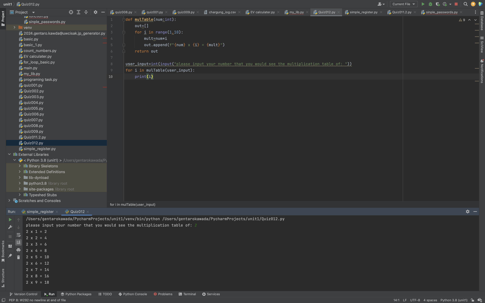
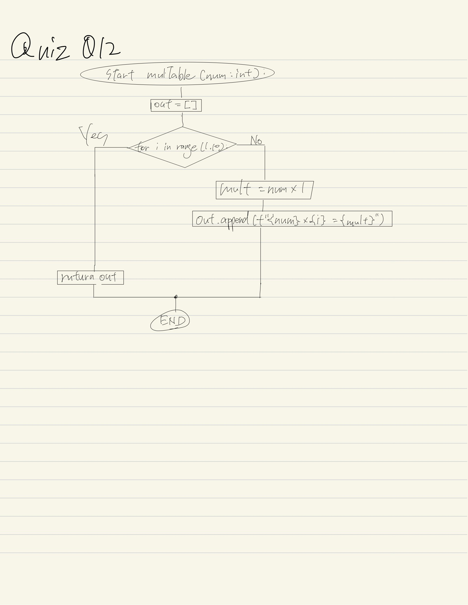

# Quiz012

## Create a function that receives integer 2<N<10, and returns the multiplication table for the number up to 9.

```.py
def july():
    week =["Fr", "Sa", "Su", "Mo", "Tu", "We", "Th"]
    day = 0
    for i in range(1,32):
        print(week[day],i , end = ",")
        day += 1
        if day % 7 == 0:
            day = 0
        elif day % 7 == 2 or day == 2:
            print("\n")
        else:
            i += 1
july()
```
## Fig.1


## Flowchart:

