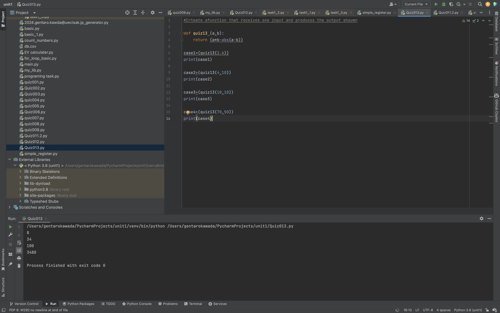
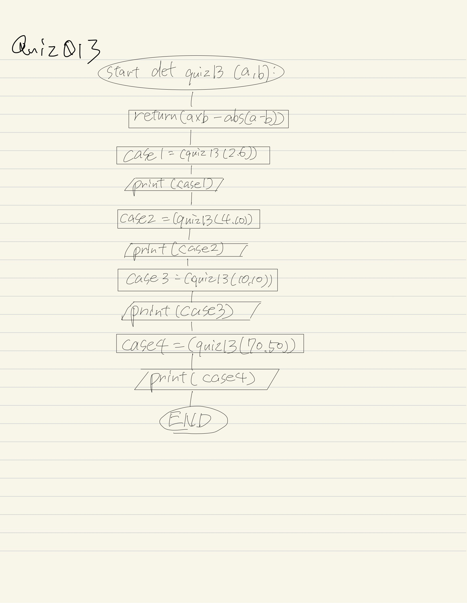

# Quiz013

## Create a function that receives one input and produces the output shown.

## :program
```.py
def quiz13 (a,b):
    return (a*b-abs(a-b))

case1=(quiz13(2,6))
print(case1)

case2=(quiz13(4,10))
print(case2)

case3=(quiz13(10,10))
print(case3)

case4=(quiz13(70,50))
print(case4)

```

## Fig.1


##Flowchart:

