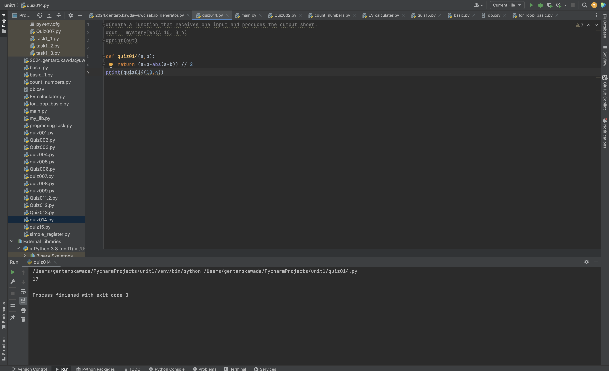

# Quiz014

## Create a function that receives one input and produces the output shown. 

```.py
PLAIN = "secret,-10"
# create a function that produces t  he output given the input shown

def blackboxThree(given:str)->str:
    given = list(given.lower())
    output = ""
    for i in range(len(given)):
        if given[i] == " ":
            output += " "
        else:
            letters = 0
            for j in range(i+1):
                if given[i] == given[j]:
                    letters += 1
            output += str(letters)
    print(output)


for i in ["Hello World","aaaaAABB","abABabAB","Create a Function"]:
    print(i)
    blackboxThree(i)
    print("\n")

print(a)
```
## Fig.1


## Flowchart:

