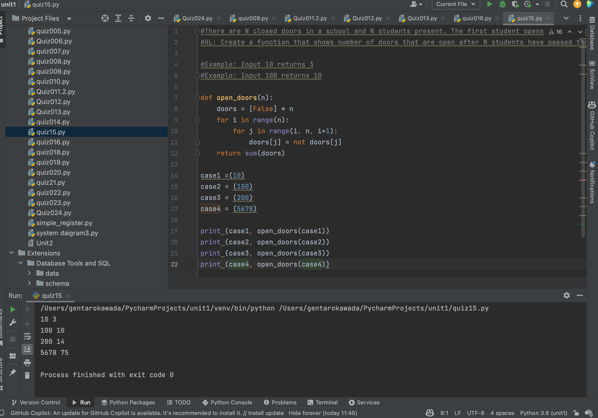

# Quiz 15
## Prompt
There are N closed doors in a school and N students present. The first student opens all the doors. The second student closes every second door. The third student toggles every third door (closes if open, opens if closed) and so on.

HL: Create a function that shows number of doors that are open after N students have passed through the school.

## Folw Diagram

## Code Structure
#There are N closed doors in a school and N students present. The first student opens all the doors. The second student closes every second door. The third student toggles every third door (closes if open, opens if closed) and so on.
#HL: Create a function that shows number of doors that are open after N students have passed through the school.

#Example: Input 10 returns 3
#Example: Input 100 returns 10

```.py
#There are N closed doors in a school and N students present. The first student opens all the doors. The second student closes every second door. The third student toggles every third door (closes if open, opens if closed) and so on.
#HL: Create a function that shows number of doors that are open after N students have passed through the school.

#Example: Input 10 returns 3
#Example: Input 100 returns 10

def open_doors(n):
    doors = [False] * n
    for i in range(n):
        for j in range(i, n, i+1):
            doors[j] = not doors[j]
    return sum(doors)

case1 =(10)
case2 = (100)
case3 = (200)
case4 = (5678)

print (case1, open_doors(case1))
print (case2, open_doors(case2))
print (case3, open_doors(case3))
print (case4, open_doors(case4))
```


##  Code Structure



## Flow Chart:


