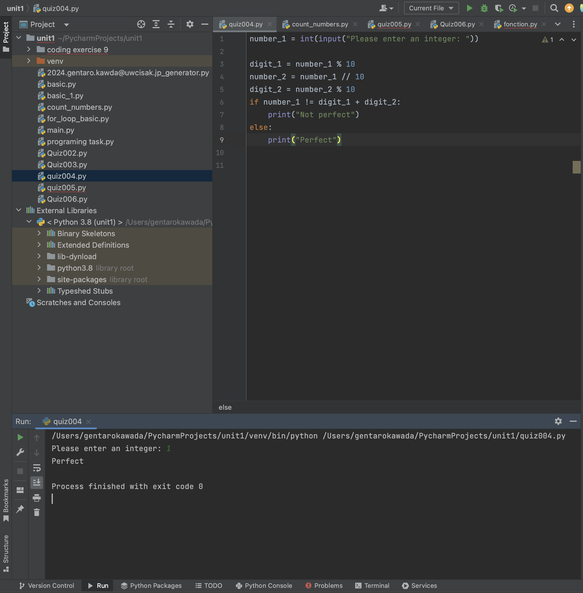
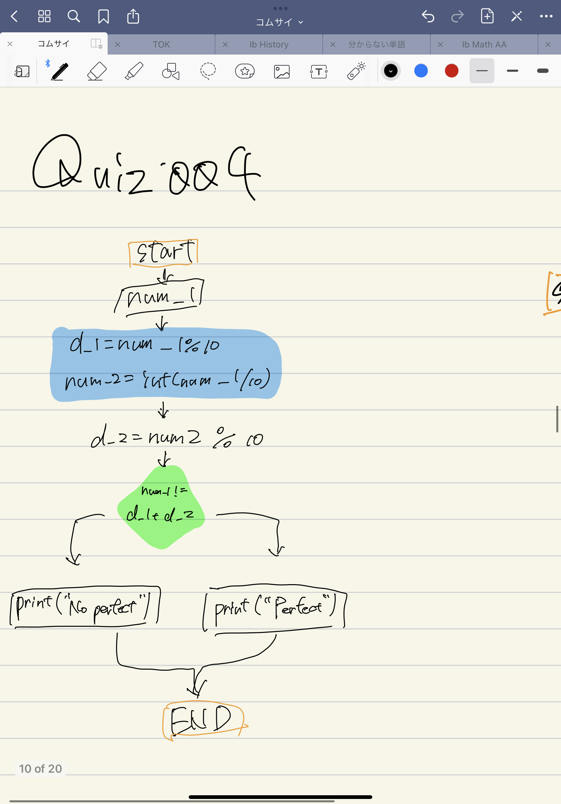

# Quiz 4


```.py
number_1 = int(input("Please enter an integer: "))

digit_1 = number_1 % 10
number_2 = number_1 // 10
digit_2 = number_2 % 10
if number_1 != digit_1 + digit_2:
    print("Not perfect")
else:
    print("Perfect")
```





Flow Chart:



