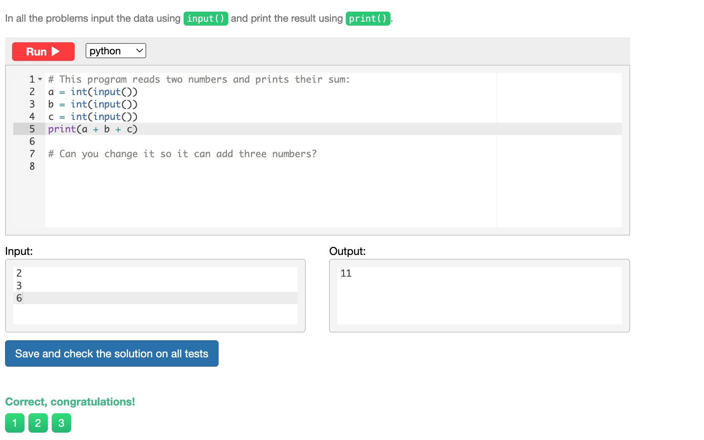
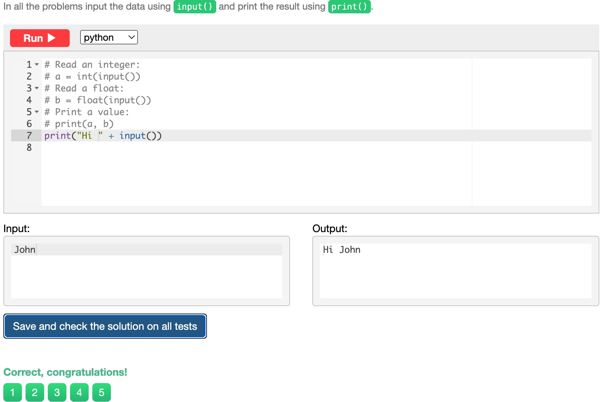
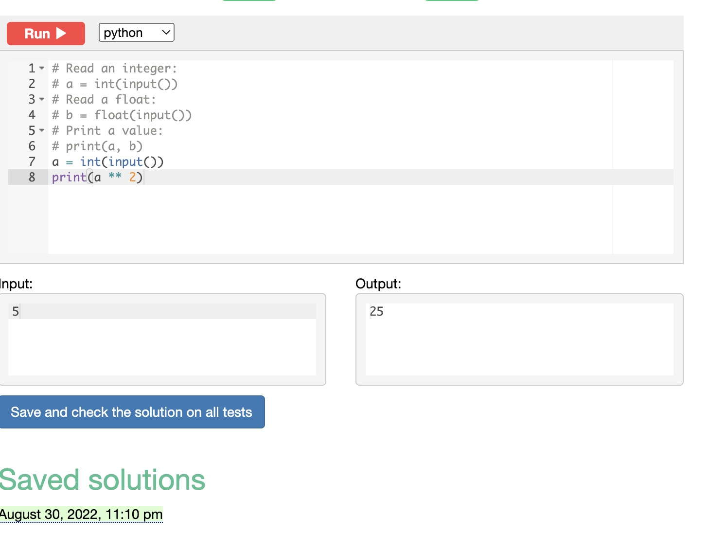
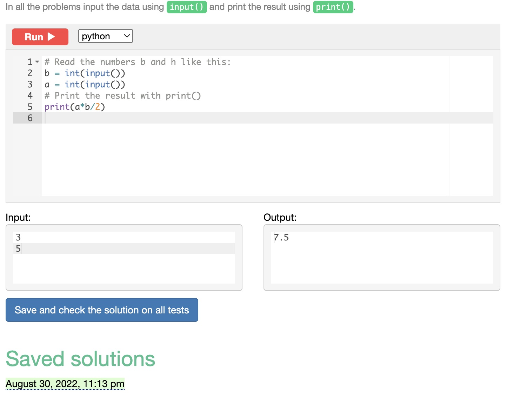
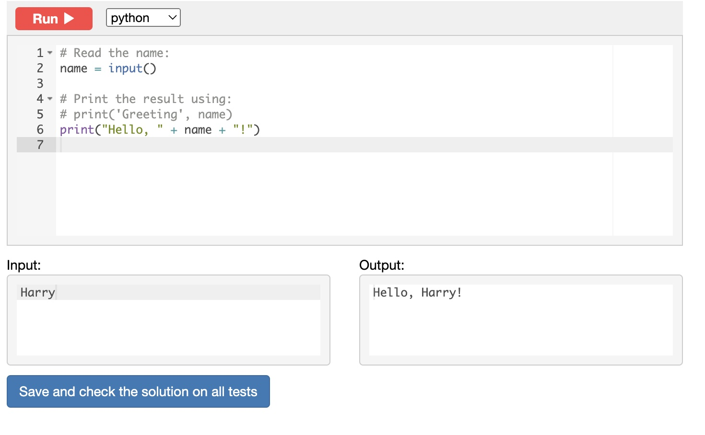

# Chapter 1

## Sum of three numbers
Write a program that takes three numbers and prints their sum. Every number is given on a separate line

```.py
a = int(input())
b = int(input())
c = int(input())
print(a + b + c)
```





## Hi John
Write a program that greets the person by printing the word "Hi" and the name of the person. See the examples below.

```.py
print("Hi " + input())
```





## Square
Write a program that takes a number and print its square


```.py
a = int(input())
print(a ** 2)
```





## Area of right-angled triangle
Write a program that reads the length of the base and the height of a right-angled triangle and prints the area. Every number is given on a separate line.


```.py
# Read the numbers b and h like this:
b = int(input())
a = int(input())
# Print the result with print()
print(a*b/2)
```





## Hello, Harry!
Write a program that greets the user by printing the word "Hello", a comma, the name of the user and an exclamation mark after it. See the examples below.


```.py
# Read the name:
name = input()

# Print the result using:
# print('Greeting', name)
print("Hello, " + name + "!")
```





##Previous and next
Write a program that reads an integer number and prints its previous and next numbers. See the examples below for the exact format your answers should take. There shouldn't be a space before the period.


```.py
a = int(input())

b = str(a + 1)
c = str(a - 1)

print('The next number for the number ' + str(a) + ' is ' + str(b) + '.')
print('The previous number for the number ' + str(a) + ' is ' + str(c) + '.')
```

 


