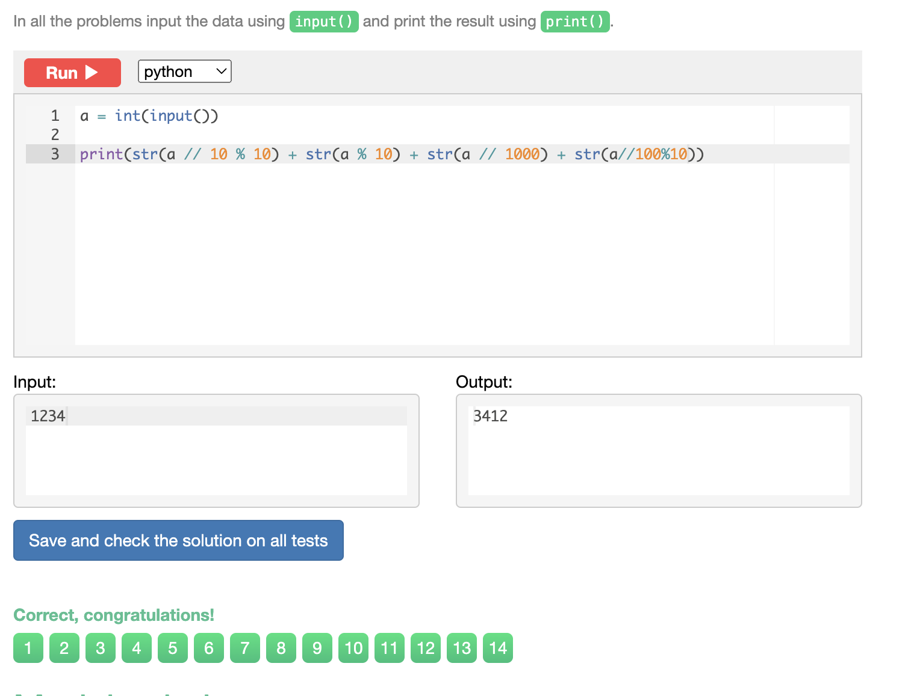

# Chapter 1

## Sum of three numbers
Write a program that takes three numbers and prints their sum. Every number is given on a separate line

```.py
a = int(input())
b = int(input())
c = int(input())
print(a + b + c)
```


## Hi John
Write a program that greets the person by printing the word "Hi" and the name of the person. See the examples below.

```.py
print("Hi " + input())
```


## Square
Write a program that takes a number and print its square


```.py
a = int(input())
print(a ** 2)
```


## Area of right-angled triangle
Write a program that reads the length of the base and the height of a right-angled triangle and prints the area. Every number is given on a separate line.


```.py
# Read the numbers b and h like this:
b = int(input())
a = int(input())
# Print the result with print()
print(a*b/2)
```


## Hello, Harry!
Write a program that greets the user by printing the word "Hello", a comma, the name of the user and an exclamation mark after it. See the examples below.


```.py
# Read the name:
name = input()

# Print the result using:
# print('Greeting', name)
print("Hello, " + name + "!")
```


## Previous and next
Write a program that reads an integer number and prints its previous and next numbers. See the examples below for the exact format your answers should take. There shouldn't be a space before the period.
Remember that you can convert the numbers to strings using the function str.


```.py
a = int(input())

b = str(a + 1)
c = str(a - 1)

print('The next number for the number ' + str(a) + ' is ' + str(b) + '.')
print('The previous number for the number ' + str(a) + ' is ' + str(c) + '.')
```

 

## Two timestamps
A timestamp is three numbers: a number of hours, minutes and seconds. Given two timestamps, calculate how many seconds is between them. The moment of the first timestamp occurred before the moment of the second timestamp.


```.py
Aa = int(input())
Ab = int(input())
Ac = int(input())

Ba = int(input())
Bb = int(input())
Bc = int(input())

print(Ba * 3600 + Bb * 60 + Bc - Aa * 3600 - Ab * 60 - Ac)
```


## School desks
A school decided to replace the desks in three classrooms. Each desk sits two students. Given the number of students in each class, print the smallest possible number of desks that can be purchased.
The program should read three integers: the number of students in each of the three classes, a, b and c respectively.

In the first test there are three groups. The first group has 20 students and thus needs 10 desks. The second group has 21 students, so they can get by with no fewer than 11 desks. 11 desks is also enough for the third group of 22 students. So we need 32 desks in total.

```.py
a = int(input())
b = int(input())
c = int(input())
 
print(a//2 + b//2 + c//2 + a % 2 + b % 2 + c % 2)
```


# Chapter　2

## Last digit of integer
Given an integer number, print its last digit.

```.py
a = int(input())

print(a%10)
```


## Two digits
Given a two-digit number, print its digits separately.

```.py
a = int(input())

print(int(a/10%10),a%10)
```


## Swap digits
Given a two-digit number, swap its digits as shown in the tests below.

```.py
a = int(input())
print(str(a % 10) + str(a // 10))
```


## Last two digits
Given an integer number, print its last two digits.

```.py
a = int(input())
print(a%100)
```


## Tens digit 
Given an interger. Print its tens digit.

```.py
a = int(input())

print(a//10 %10)
```


## Sum of digits
Given a three-digit number.Fing the sum of its digits.

```.py
a = int(input())
print((a//100) + (a%100-a%10)/10 + (a%10)) 
```


## Reverse three digits
Given a three-digit integer number, print its digits in a reversed order.

```.py
a = int(input())
A = str(a%10)
B = str(int((a%100-a%10)/10))
C = str(a//100)

print(A+B+C)
```


## Merge two numbers
Given two two-digit numbers, merge their digits as shown in the tests below.

```.py
a = int(input())
b = int(input())

print(str(a // 10) + str(b // 10)+ str(a % 10) + str(b % 10))

```


## Cyclic rotation
Given a four-digit integer number, perform its cyclic rotation by two digits, as shown in the tests below.

```.py
a = int(input())

print(str(a // 10 % 10) + str(a % 10) + str(a // 1000) + str(a//100%10))
```



## Fractional part
Given a positive real number, print its fractional part.

```.py
a = float(input())

b = (a%1)

print(b)
```


## First digit after decimal point
Given a positive real number, print its first digit to the right of the decimal point.

```.py
a = float(input())
print(abs(a % 0.10 - a % 1)* 10)
```


## Car route
A car can cover distance of N kilometers per day. How many days will it take to cover a route of length M kilometers? The program gets two numbers: N and M.

```.py
from math import ceil

N = int(input())
M = int(input())
print(ceil(M/N))
```


## Day of week
Let's count the days of the week as follows: 0 - Sunday, 1 - Monday, 2 - Tuesday, ..., 6 - Saturday. Given an integer K in the range 1 to 365, find the number of the day of the week for the K-th day of the year provided that this year's January 1 is Thursday.

```.py
a = int(input())
print((a +3)%7)
```


## Digital clock
Given the integer N - the number of minutes that is passed since midnight - how many hours and minutes are displayed on the 24h digital clock?
The program should print two numbers: the number of hours (between 0 and 23) and the number of minutes (between 0 and 59).

For example, if N = 150, then 150 minutes have passed since midnight - i.e. now is 2:30 am. So the program should print 2 30.


```.py
s = int(input())
h = s // 60
m = s % 60
print(h,m)
```


## Total cost
A cupcake costs A dollars and B cents. Determine, how many dollars and cents should one pay for N cupcakes. A program gets three numbers: A, B, N. It should print two numbers: total cost in dollars and cents.


```.py
a = int(input())
b = int(input())
n = int(input())
K =((a*100 + b)*n)
print((K // 100), ((K % 100)))
```


## Century
Given a year as a positive integer, print its century. Mind that the 20th century began on 1901 and ended on 2000.

```.py
a = int(input())
print((a-1) // 100 + 1)
```


## Snail
A snail goes up A feet during the day and falls B feet at night. How long does it take him to go up H feet?
Given three integer numbers H, A and B (A > B), the program should output a number of days

```.py
from math import ceil

H = int(input())
A = int(input())
B = int(input())
diff = A - B
print(ceil((H - A) / (diff)) + 1)
```


## Clock face - 1
H hours, M minutes and S seconds are passed since the midnight (0 ≤ H < 12, 0 ≤ M < 60, 0 ≤ S < 60). Determine the angle (in degrees) of the hour hand on the clock face right now.

```.py
H = int(input())
M = int(input())
S = int(input())
A = H / 12 * 360
A = A + (360 / 12 / 60 * M)
A = A + (360 / 12 / 60 / 60 * S)
print(A)
```


## Clock face - 2
Hour hand turned by α degrees since the midnight. Determine the angle by which minute hand turned since the start of the current hour. Input and output in this problems are floating-point numbers.


```.py
a = float(input())
print(a % 30 *12)
```


