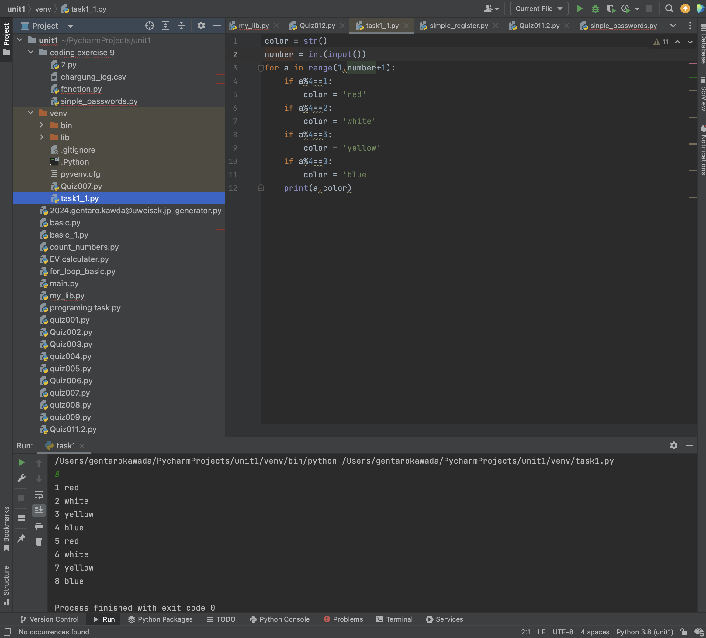
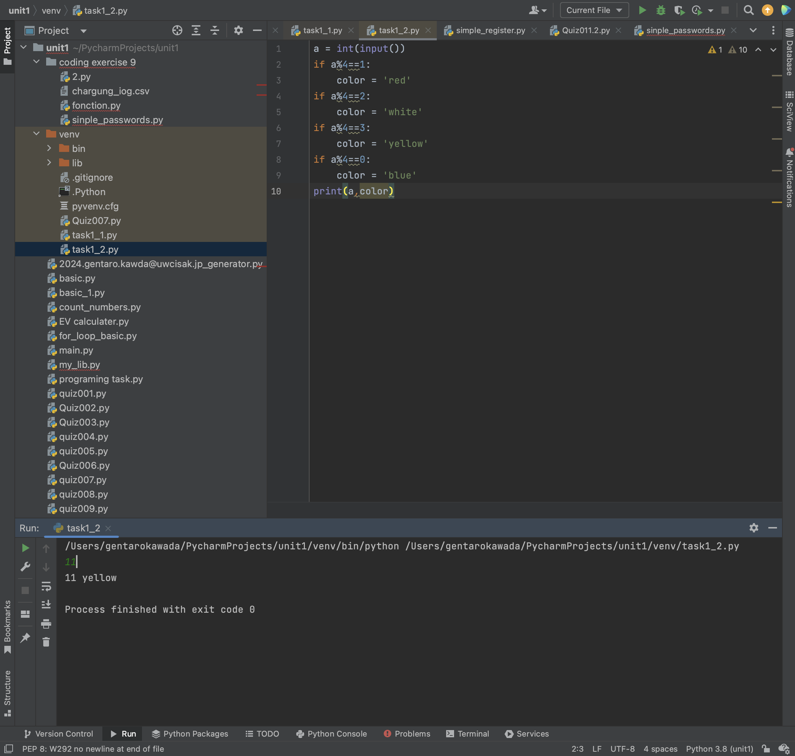

# Task 1
Task 1: Create a program and the flow diagram that shows the colors of all the lockers from 1 to 2400

Task 2: Using the program above, create another program that allows the user to enter a number and the program outputs the color that should be used in the locker.

## Code Struture
Task 1
'''.py
color = str()
number = int(input())
for a in range(1,number+1):
    if a%4==1:
        color = 'red'
    if a%4==2:
        color = 'white'
    if a%4==3:
        color = 'yellow'
    if a%4==0:
        color = 'blue'
    print(a,color)
 '''
 
 
 Task 2
 '''.py
 a = int(input())
if a%4==1:
    color = 'red'
if a%4==2:
    color = 'white'
if a%4==3:
    color = 'yellow'
if a%4==0:
    color = 'blue'
print(a,color)
'''

